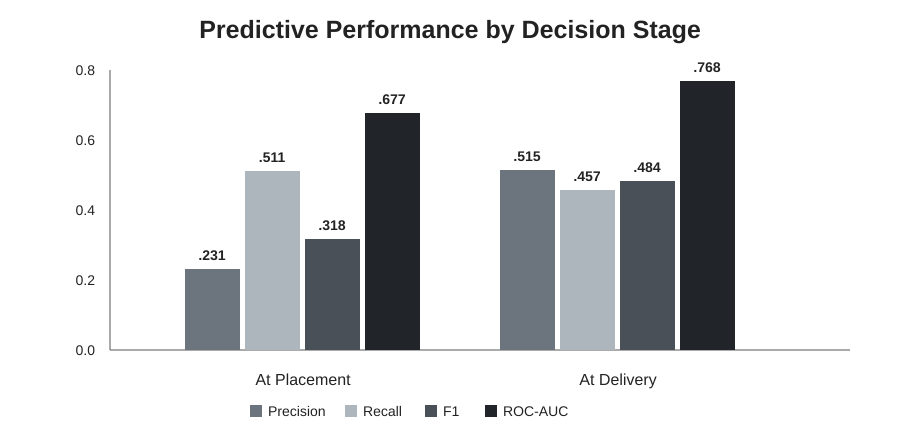
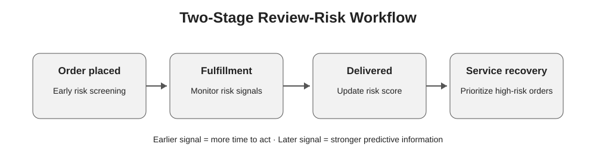
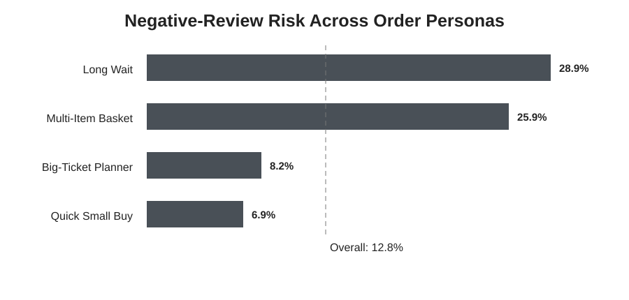
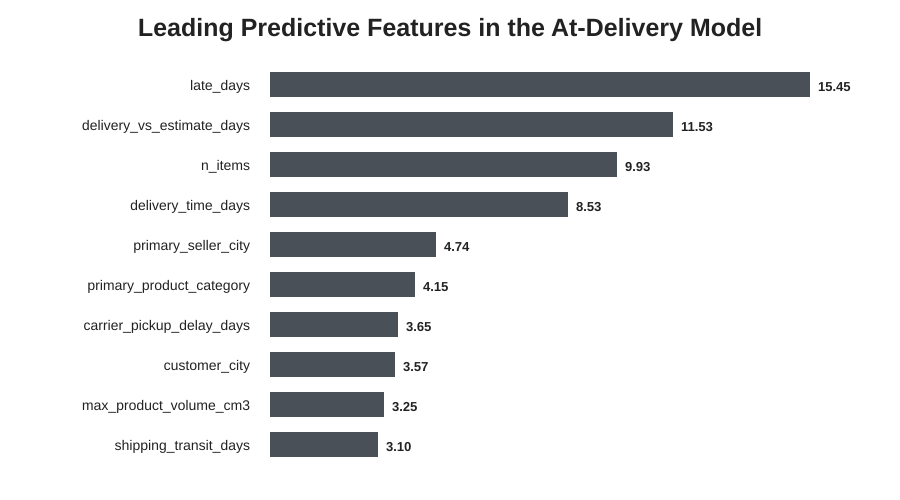

# Predicting Negative Customer Reviews in Brazilian E-Commerce

> **How early can an e-commerce platform identify an order that is likely to result in a negative customer review?**

This project studies negative-review risk across the Olist order lifecycle. I compare two decision points: **when an order is placed** and **after it is delivered**. The comparison highlights a practical trade-off between acting early and waiting for stronger information.

## Results at a glance

**95,824 delivered orders · 12.8% negative reviews (1–2 stars)**

| Decision point | Model | Precision | Recall | F1 | ROC-AUC |
|---|---|---:|---:|---:|---:|
| At placement | LightGBM | 0.231 | **0.511** | 0.318 | 0.677 |
| At delivery | CatBoost | **0.515** | 0.457 | **0.484** | **0.768** |

The placement model catches roughly half of eventual negative reviews, but with relatively low precision. Once fulfillment information becomes available, F1 rises from **0.318 to 0.484** and ROC-AUC from **0.677 to 0.768**. The later model is more selective, but it also leaves less time for preventive action.

<p align="center"></p>

## Why model at two points?

The useful question is not simply which algorithm scores highest. The amount of information available changes as an order moves through fulfillment.

**Order placed → early risk screening → fulfillment → delivery-stage risk update → service recovery**

At placement, the platform can still intervene early, but it has limited evidence about how the order will unfold. At delivery, actual fulfillment information provides a stronger signal, making the model more suitable for targeted service recovery.

<p align="center"></p>

## Order personas

For the portfolio version, I rebuilt K-Means on the same frozen **95,824-order cohort** used by the supervised models. The original seven behavioral and fulfillment variables were retained. Seventeen missing clustering inputs were median-imputed so the clustering and supervised analyses now reconcile to the same cohort.

| Persona | Orders | Share | Negative-review rate | What distinguishes it |
|---|---:|---:|---:|---|
| Long Wait | 16,705 | 17.4% | **29.1%** | ~25.3 delivery days; 39.5% delivered late |
| Multi-Item Basket | 8,306 | 8.7% | **25.9%** | ~2.5 items; high freight; generally early |
| Big-Ticket Planner | 26,692 | 27.9% | 8.2% | higher-value, heavier orders; ~4.9 installments |
| Quick Small Buy | 44,121 | 46.0% | 6.9% | low-value, light orders; ~8.3 delivery days |

Review outcome was **not** used to fit the clusters. The silhouette score is about **0.204**, so these should be read as useful descriptive profiles rather than sharply separated natural customer types.

<p align="center"></p>

## Final delivery model

CatBoost produced the strongest delivery-stage result. The leading predictive features were `late_days`, `delivery_vs_estimate_days`, `n_items`, and `delivery_time_days`.

These are **predictive associations, not causal effects**. Feature importance does not show that changing one variable would directly change a customer's review.

<p align="center"></p>

## Technical workflow

The repository now separates the project into readable technical stages:

1. **Data preparation** — order-level integration logic, cohort definition, target construction, feature timing, leakage checks and shared split.
2. **Clustering** — canonical 95,824-order K-Means rebuild and persona profiling.
3. **At-placement modeling** — Logistic Regression baseline, LightGBM, feature engineering, cross-validation and tuning logic.
4. **At-delivery modeling** — Logistic Regression / tree benchmarks, CatBoost, feature selection, tuning and threshold logic.
5. **Model interpretation** — held-out comparison, feature importance and error-analysis framework.

The compact integrated notebook is retained as a short walkthrough, while the stage notebooks make the technical logic easier to inspect.

## Leakage control

The target is `review_bad = 1` for review scores 1–2 and `0` for scores 3–5. Review timestamps and review score are excluded from predictors. Delivery outcomes are excluded from the placement model because they would not be known when the order is created. Historical reputation features are constructed chronologically so an order does not contribute its own outcome to its history.

## Business interpretation

The two models serve different purposes rather than competing for a single deployment slot. The placement model is appropriate for low-cost monitoring or early communication; the delivery model can prioritize higher-confidence service-recovery cases.

A production implementation would still need an intervention test. Predicting dissatisfaction is not the same as proving that contacting a flagged customer improves retention, review score, or economics.

## Repository guide

```text
olist-negative-review-prediction/
├── assets/
├── notebooks/
│   ├── 01_data_preparation.ipynb
│   ├── 02_clustering.ipynb
│   ├── 03_at_placement_model.ipynb
│   ├── 04_at_delivery_model.ipynb
│   ├── 05_model_interpretation.ipynb
│   └── olist_negative_review_end_to_end.ipynb
├── outputs/
├── data/
│   └── README.md
├── requirements.txt
└── README.md
```

## Reproducibility boundary

The raw Olist relational CSVs and the large team-generated processed master table are not committed here. The notebooks expose the data logic and model-development workflow, but I do **not** claim that a fresh clone can reproduce the entire project from raw data without obtaining the source dataset first. Compact verified model artifacts are included for inspection.

## Limitations

The analysis is restricted to delivered orders with observed reviews. Review score identifies dissatisfaction but not its cause. Feature importance is not causal. The final CatBoost tuning search was limited, and the placement and delivery results retained here come from the verified held-out prediction artifacts. Future work would package the raw-data build into reusable source modules and test whether model-driven interventions create measurable business value.

## Tools

Python · pandas · NumPy · scikit-learn · LightGBM · CatBoost · Optuna · Matplotlib

---

**Lambert Tan**  
Master of Management in Analytics · Smith School of Business, Queen's University
