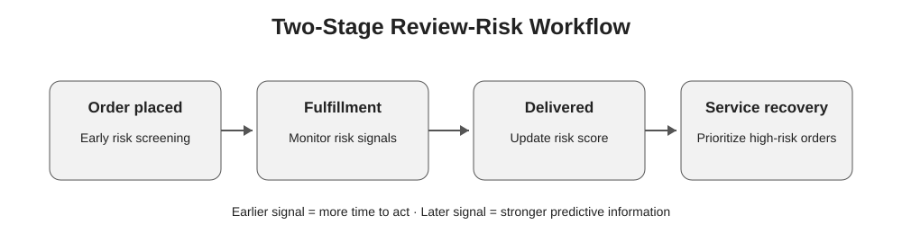
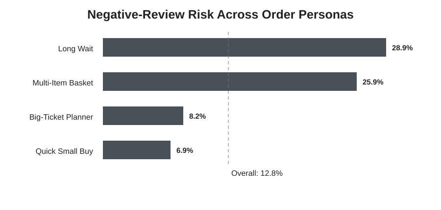

# Predicting Negative Customer Reviews in Brazilian E-Commerce

> **How early can an e-commerce platform identify an order that is likely to result in a negative customer review?**

**Python · LightGBM · CatBoost · Clustering · Power BI · Customer Analytics**

This project uses the public Olist Brazilian E-Commerce dataset to study when negative customer reviews can be identified during the order lifecycle. I rebuilt the analysis from the order-level data pipeline through modeling and interpretation, then added a Power BI layer to make the results easier to use from a business perspective.

The main question is how early useful risk signals appear. I compare predictions made when an order is placed with predictions made after delivery, then examine which operational factors are most strongly associated with negative reviews.

## Results at a glance

**95,824 delivered orders · 12.8% negative reviews (1–2 stars)**

| Decision point | Model | Precision | Recall | F1 | ROC-AUC |
|---|---|---:|---:|---:|---:|
| At placement | LightGBM | 0.221 | **0.478** | 0.302 | 0.658 |
| At delivery | CatBoost | **0.601** | 0.408 | **0.486** | **0.774** |

- The **placement model** works as an early-warning screen. It captures close to half of eventual negative reviews, but also produces more false positives.
- The **delivery model** is more selective and performs better on both F1 and ROC-AUC.
- Classification thresholds are selected on validation data, while the frozen test set is reserved for final evaluation.
- The two models are useful at different stages of the order lifecycle.

## Business workflow

The analysis is organized around two decision points:

**Order placed → early risk screening → fulfillment → delivery-stage risk update → service recovery**

At placement, the score can support lower-cost actions such as monitoring or proactive communication. After delivery, the stronger CatBoost signal can help prioritize a smaller set of higher-risk orders for service recovery.

<p align="center"></p>

A production rollout would still require an intervention experiment. Predicting dissatisfaction does not show that contacting a flagged customer will improve retention, review scores, or unit economics.

## Customer personas

I rebuilt K-Means on the same frozen **95,824-order cohort** used by the supervised models so the clustering and prediction results are based on the same set of orders.

| Persona | Orders | Share | Negative-review rate | What distinguishes it |
|---|---:|---:|---:|---|
| Long Wait | 16,705 | 17.4% | **29.1%** | ~25.3 delivery days; 39.5% delivered late |
| Multi-Item Basket | 8,306 | 8.7% | **25.9%** | ~2.5 items; high freight; generally early |
| Big-Ticket Planner | 26,692 | 27.9% | 8.2% | higher-value, heavier orders; ~4.9 installments |
| Quick Small Buy | 44,121 | 46.0% | 6.9% | low-value, light orders; ~8.3 delivery days |

Review outcome is not used to fit the clusters. The silhouette score is approximately **0.204**, so these groups are better treated as descriptive order profiles than as sharply separated natural clusters.

<p align="center"></p>

## Final delivery-stage model

CatBoost gave the best delivery-stage performance in the final comparison. The leading predictive features are:

- `late_days`
- `delivery_vs_estimate_days`
- `n_items`
- `delivery_time_days`

These variables are useful predictors, but the importance values should not be interpreted causally. A high feature importance does not mean that changing that variable alone would change a customer's review.

## Data and leakage controls

The analysis uses a single one-row-per-order dataset, with features separated according to when they become available.

- `review_bad = 1` for review scores 1–2 and `0` for scores 3–5.
- Review score and review timestamps are excluded from predictors.
- Delivery outcomes are excluded from the placement model.
- One-to-many tables such as items and payments are aggregated before joining to the order-level target.
- Model-specific imputation and categorical handling are estimated from training data only.
- Threshold selection uses validation data instead of the held-out test set.

## Workflow

1. **Data join and cleaning** — combine the Olist relational tables, resolve duplicate reviews, aggregate one-to-many tables, and create a one-row-per-order dataset.
2. **Feature engineering** — separate information available at placement from information only observed after fulfillment.
3. **Clustering** — build four descriptive order personas on the same analytical cohort.
4. **At-placement modeling** — train a LightGBM classifier for early risk screening and save order-level test probabilities.
5. **At-delivery modeling** — train CatBoost with fulfillment information, select the operating threshold, and save order-level probabilities.
6. **Model interpretation** — compare both decision points, review feature importance, and inspect error patterns.
7. **Power BI export** — prepare a single order-level table for business-facing analysis.

## Repository structure

```text
olist-negative-review-prediction/
├── assets/
├── data/
│   ├── raw/
│   ├── processed/
│   └── powerbi/
├── notebooks/
│   ├── 01_data_join_and_clean.ipynb
│   ├── 02_clustering.ipynb
│   ├── 03_at_placement_model.ipynb
│   ├── 04_at_delivery_model.ipynb
│   ├── 05_model_interpretation.ipynb
│   ├── 06_powerbi_export.ipynb
│   └── olist_negative_review_end_to_end.ipynb
├── outputs/
│   ├── model_metrics/
│   ├── interpretation/
│   └── predictions/
├── powerbi/
├── requirements.txt
└── README.md
```

## Power BI extension

The Power BI report uses the outputs of the Python workflow instead of rebuilding the analysis separately. It reads the curated `data/powerbi/powerbi_order_risk.csv` file so the dashboard stays consistent with the modeling pipeline.

Planned report pages:

- **Executive Risk Overview** — negative-review rate, late-delivery rate, monthly trend, state, category, and persona views.
- **Risk Drivers** — delivery delay, order characteristics, and segment patterns associated with negative reviews.
- **Customer Recovery Queue** — test-set orders ranked by predicted delivery risk for follow-up.

## Reproducibility

Raw Olist source files are not committed. The processed master table is also kept local because of its size. The expected folder structure and data contract are documented in `data/README.md`.

All downstream notebooks use the same processed order-level dataset. This keeps the analysis consistent and avoids maintaining multiple versions of the data. Running notebooks 03 and 04 recreates the order-level prediction files used by notebook 06.

## Limitations

The analysis is restricted to delivered orders with observed reviews. Review score indicates dissatisfaction but does not identify its underlying cause. Feature importance is not causal, and the hyperparameter search is intentionally limited in this portfolio version.

The next step is to complete the Power BI report and evaluate intervention thresholds using explicit business-cost assumptions.

## Tools

Python · pandas · NumPy · scikit-learn · LightGBM · CatBoost · Matplotlib · Power BI · Power Query · DAX

---

**Lambert Tan**