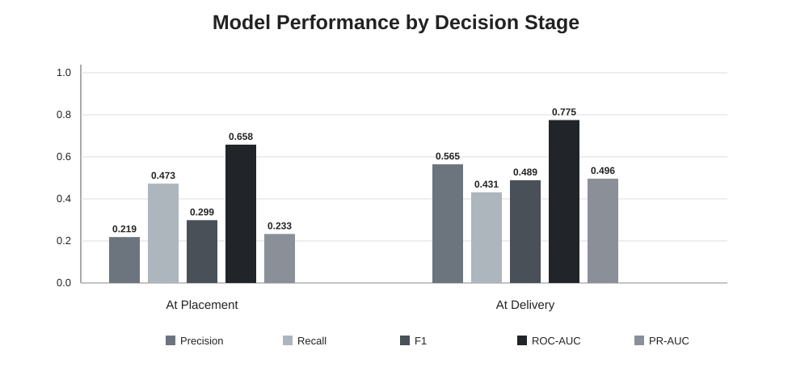
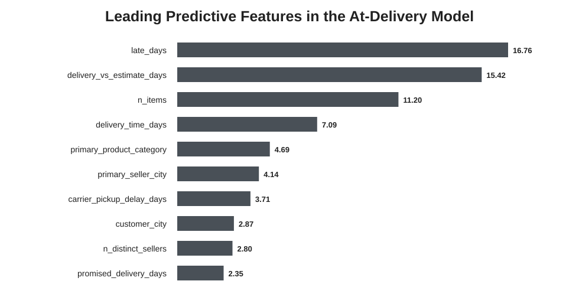

# Predicting Negative Customer Reviews in Brazilian E-Commerce

> **How early can an e-commerce platform identify an order that is likely to result in a negative customer review?**

**Python · LightGBM · CatBoost · Clustering · Power BI · Customer Analytics**

This is my end-to-end portfolio implementation of a customer review risk analytics workflow using the public Olist Brazilian E-Commerce dataset. I rebuilt the data pipeline, organized the modeling workflow around two decision points, reworked the segmentation and interpretation layers, and extended the project into a Power BI decision-support use case.

The core business question is not simply whether a model can predict a bad review. It is **when the platform has enough information to act, what operational signals matter most, and how those predictions can be translated into a usable customer-service workflow.**

## Results at a glance

**95,824 delivered orders · 12.8% negative reviews (1–2 stars)**

| Decision point | Model | Precision | Recall | F1 | ROC-AUC |
|---|---|---:|---:|---:|---:|
| At placement | LightGBM | 0.231 | **0.511** | 0.318 | 0.677 |
| At delivery | CatBoost | **0.515** | 0.457 | **0.484** | **0.768** |

- The **placement model** acts as an early-warning screen. It captures about half of eventual negative reviews, but with more false positives.
- The **delivery model** is more selective and materially stronger on F1 and ROC-AUC.
- The two models support different business actions rather than one simply replacing the other.

<p align="center"></p>

## Business workflow

I structure the project around two intervention points:

**Order placed → early risk screening → fulfillment → delivery-stage risk update → service recovery**

At placement, risk scores are suitable for lower-cost actions such as monitoring or proactive communication. After delivery, the stronger CatBoost signal can support higher-confidence service-recovery prioritization.

<p align="center"></p>

A production rollout would still need an intervention experiment. Predicting dissatisfaction does not prove that contacting a flagged customer will improve retention, review score, or economics.

## Customer personas

I rebuilt K-Means on the same frozen **95,824-order cohort** used by the supervised models so the descriptive and predictive analyses stay aligned.

| Persona | Orders | Share | Negative-review rate | What distinguishes it |
|---|---:|---:|---:|---|
| Long Wait | 16,705 | 17.4% | **29.1%** | ~25.3 delivery days; 39.5% delivered late |
| Multi-Item Basket | 8,306 | 8.7% | **25.9%** | ~2.5 items; high freight; generally early |
| Big-Ticket Planner | 26,692 | 27.9% | 8.2% | higher-value, heavier orders; ~4.9 installments |
| Quick Small Buy | 44,121 | 46.0% | 6.9% | low-value, light orders; ~8.3 delivery days |

Review outcome is not used to fit the clusters. The silhouette score is approximately **0.204**, so I treat these as descriptive order personas rather than sharply separated natural groups.

<p align="center"></p>

## Final delivery-stage model

CatBoost produced the strongest delivery-stage result. The leading predictive features were:

- `late_days`
- `delivery_vs_estimate_days`
- `n_items`
- `delivery_time_days`

<p align="center"></p>

These are predictive associations, not causal effects. Feature importance does not imply that changing one variable would directly change a customer's review.

## Data and leakage controls

I keep a single one-row-per-order analytical dataset and separate features by when they become available.

- `review_bad = 1` for review scores 1–2 and `0` for scores 3–5.
- Review score and review timestamps are excluded from predictors.
- Delivery outcomes are excluded from the placement model.
- One-to-many tables such as items and payments are aggregated before joining to the order-level target.
- Model-specific imputation, encoding and scaling are left inside training pipelines to avoid leakage.

## End-to-end workflow

1. **Data join and cleaning** — integrate the relational Olist tables, resolve duplicates, aggregate one-to-many tables and create a one-row-per-order master dataset.
2. **Feature engineering** — separate placement-stage and delivery-stage information while preserving feature timing.
3. **Clustering** — rebuild four descriptive order personas on the same analytical cohort.
4. **At-placement modeling** — compare an interpretable baseline with the final LightGBM result.
5. **At-delivery modeling** — compare benchmarks with CatBoost, tune the model and evaluate held-out performance.
6. **Model interpretation** — compare decision points, inspect feature importance and interpret error patterns.
7. **Power BI deployment layer** — export one curated order-level table for business-facing analysis and operational prioritization.

## Repository structure

```text
olist-negative-review-prediction/
├── assets/
├── data/
│   ├── raw/
│   ├── processed/
│   └── powerbi/
├── notebooks/
│   ├── 01_data_join_and_clean.ipynb
│   ├── 02_clustering.ipynb
│   ├── 03_at_placement_model.ipynb
│   ├── 04_at_delivery_model.ipynb
│   ├── 05_model_interpretation.ipynb
│   ├── 06_powerbi_export.ipynb
│   └── olist_negative_review_end_to_end.ipynb
├── outputs/
│   ├── model_metrics/
│   ├── interpretation/
│   └── predictions/
├── powerbi/
├── requirements.txt
└── README.md
```

## Power BI extension

Power BI is the final deployment layer rather than a separate analysis. The dashboard reads only the curated `data/powerbi/powerbi_order_risk.csv` export so the data lineage remains consistent with the Python workflow.

Planned report pages:

- **Executive Risk Overview** — negative-review rate, late-delivery rate, monthly trend, state, category and persona views.
- **Risk Drivers** — delivery delay, order characteristics and segment patterns associated with negative reviews.
- **Customer Recovery Queue** — once order-level model probabilities are available, rank cases by predicted risk for operational follow-up.

## Reproducibility

Raw Olist source files are not committed. The processed master table is also kept local because of its size. The repository documents the complete data contract and expected folder structure under `data/README.md`.

The analytical workflow is organized so every downstream step reads from the same canonical processed dataset rather than separate ad hoc files.

## Limitations

The analysis is restricted to delivered orders with observed reviews. Review score identifies dissatisfaction but not its underlying cause. Feature importance is not causal, and the final CatBoost tuning search was intentionally limited.

The next practical extension is to persist order-level placement and delivery probabilities, incorporate them into the Power BI export, and test intervention thresholds against explicit business costs.

## Tools

Python · pandas · NumPy · scikit-learn · LightGBM · CatBoost · Optuna · Matplotlib · Power BI · Power Query · DAX

---

**Lambert Tan**